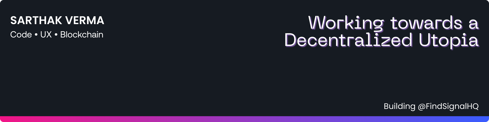

##### `I love building products.`

🌱 Currently learning Next, Node/Express, Databases and Solidity. Exploring Web3.

✨ Working on my UX and Creative writing skills. I love Designing Interfaces with a great UX.

📒 Documenting my Journey and learning at [my personal internet corner](https://sarthakverma.vercel.app).

🦾 Build and Ship FTW!

📩 Fastest way to reach me? Shoot DM on [LinkedIn](https://linkedin.com/in/sarthakv), [Twitter](https://twitter.com/0xSarthak) or [email](mailto:sarthakvdev@gmail.com)

 

 

### Development Stack

    
    
    
    
    
    
    
    

### Languages

    
    

### Bonus Tools

    
    

### Connect with me

---

Imported the badges from [Github Badges](https://github.com/Ileriayo/markdown-badges)
